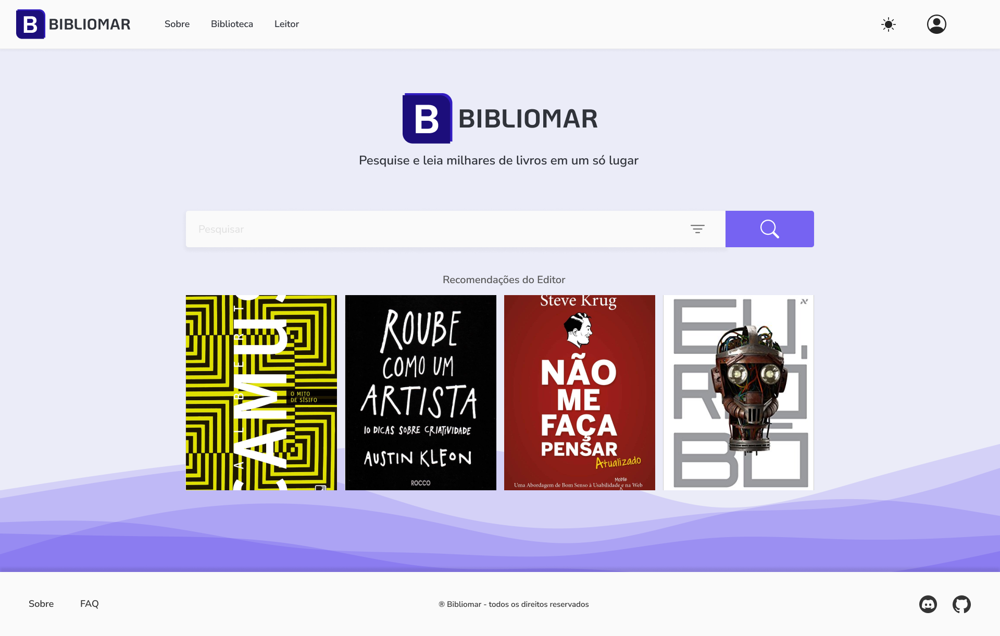

<h4>O Bibliomar é um buscador de livros, artigos e outros tipos de texto. </h4>

O usuario também pode usar o sistema de biblioteca para armazenar e catalogar seus livros.

Construido usando tecnologias modernas e com um sistema de pesquisa robusto, esse atualmente é meu projeto pessoal mais ambicioso.

O projeto pode ser visualizado [aqui](https://www.bibliomar.site).

Eu separei o Bibliomar em diversos repositórios, cada um com uma função específica. Esse artigo apresenta a visão geral de cada parte do projeto. Boa leitura!

Tecnologias utilizadas 🚀
- HTML, CSS, Typescript & React
- Python & FastAPI
- Java & Spring Boot (Spring Web, Spring Data, Spring Security)
- JWT
- MySQL / MariaDB
- MongoDB
- ManticoreSearch

O resultado: uma experiência de pesquisa fluída e extremamente rápida.

### [Cliente](https://github.com/bibliomar/bibliomar-client)

O front-end do Bibliomar foi escrito em Typescript, com HTML/CSS3 para estilização dos componentes. Utilizei a biblioteca MDBootstrap para utilidades como definição de margem, paddings e etc. Apesar disso, o Bibliomar foi implementado com base em um design system próprio, e por isso a maioria dos estilos vem de classe criadas a mão.

O Bibliomar é uma aplicação de página única (SPA), e por isso toda a experiência de navegação é extremamente fluída. 
O usuarío nunca encontra um momento onde algo não esteja na tela. Nós utilizamos todo o poder dos React Hooks, além das bibliotecas do ecossistema React para otimizar a experiência de pesquisa e navegação.

O repositório do front-end poder ser visualizado [aqui](https://github.com/bibliomar/bibliomar-client).

### [Servidor](https://github.com/bibliomar/bibliomar-server)

O backend do Bibliomar é uma API Rest construída em Java, utilizando o framework Spring Boot.  
O maior feito dessa API é consumir e servir dados de mais de 6,3 milhões de colunas no banco de dados MySQL, tudo isso com uma ótima otimização de recursos. A integração do Spring Data facilita a vida dos desenvolvedores, e o Spring facilita a implementação de código assíncrono utilizando Threads. E por último, mas não menos importante: o Spring Security nos permite garantir a criptografia dos dados sensíveis (como senhas) de todos os usuarios.

Um coadjuvante muito importante, e o principal responsável pela velocidade (e precisão) de pesquisa do Bibliomar é o ManticoreSearch. Com uma instãncia programada para indexar as mais de 6,3mi de linhas, ele é perfeito para pesquisas com compreensão de linguagem humana em bases de dados gigantescas. 

Em termos simples, isso significa que o usuario pode realizar pesquisas com termos abrangentes, com erros de digitação, e mesmo assim receber resultados relevantes.

O repositório do back-end pode ser visualizado [aqui](https://github.com/bibliomar/bibliomar-server)

### [Scrapper](https://github.com/bibliomar/bibliomar-scrapper)

Esse repositório mantém o back-end antigo do Bibliomar, que também é uma API Rest, só que desenvolvida utilizando Python e o framework FastAPI.

O motivo para essa escolha foi que originalmente o Bibliomar era um projeto de scrapping. O banco de dados utilizado por essa API era o MongoDB, onde armazenamos exclusivamente os dados dos usuarios. A segurança de cripografia vem da biblioteca *passlib*. 

Por muito tempo, esse servidor ficou hospedado em uma instância gratuita do [fly.io](https://fly.io/), em uma máquina com apenas 256MB de RAM. Todos os controladores trabalham de forma assíncrona, e a [biblioteca de scrapping]() (responsável por pesquisar e retornar resultados) que desenvolvi também faz requisições e processamento dessa forma.

O repositório desse back-end antigo pode ser visualizado [aqui](https://github.com/bibliomar/bibliomar-scrapper).

### A experiência

Muito do meu conhecimento provém do que tive de aplicar nesse projeto. Tenho muito orgulho em dizer que conheci muita gente especial durante o desenvolvimento dele. Encontrei um mentor, e também encontrei um amigo.

Ele não seria a mesma coisa se eu não tivesse incentivo de minha família (esposa e filho). Hoje eu considero esse projeto um exemplo do porquê eu gosto tanto de fazer o que faço: ideias simples, quando bem executadas, facilitam a vida das pessoas, e pequenos projetos podem se tornar parte indispensável do dia de alguém. Esse é o poder da programação.

O Bibliomar é um projeto feito com muito carinho. De um estudante para outros. 

Muito obrigado pela leitura.

